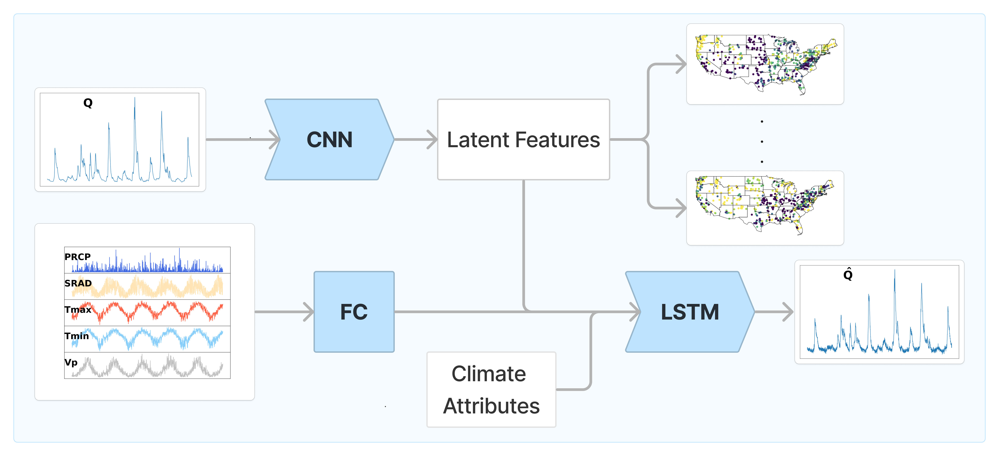

# AE4Hydro  

Repository accompanying the publication:

> **Learning landscape features from streamflow with autoencoders**  
> Alberto Bassi et al.  
> *Hydrology and Earth System Sciences (2024)*  
> https://doi.org/10.5194/hess-28-4971-2024

---

## Overview

AE4Hydro investigates whether **catchment landscape characteristics can be learned directly from streamflow observations** using conditional autoencoders.

Traditional hydrological models often rely on manually engineered static attributes (e.g., cliamte, topography, soil, vegetation and geology). This work instead learns **latent hydrological representations** from discharge time series through an **Explicit Noise Conditional Autoencoder (ENCA)** framework.

The objective is to disentangle:

- **Meteorological forcing information**
- **Landscape-dependent hydrological behavior**

The learned latent space acts as a compact representation of catchment properties while preserving predictive skill.

---

## Method

The framework trains an autoencoder conditioned on meteorological inputs to reconstruct streamflow while encouraging the latent representation to encode landscape information.

<p align="center">
  
</p>

---

## Repository Structure

```text
AE4Hydro/
│
├── analysis/             # Analysis scripts and experiment evaluation
├── data/                 # Data storage and preprocessing outputs
├── reports/              # Generated reports, figures, and results
├── runs/                 # Training outputs and saved experiment runs
├── src/                  # Core implementation
│
├── main.py               # Main entry point for model training
├── run_analysis.py       # Run post-training analyses
├── run_analysis.sh       # Analysis execution script
├── train.sh              # Training launcher
├── environment.yml       # Conda environment definition
│
└── README.md
```

---


## Setup environment

```bash
conda env create -f environment.yml
conda activate ae4hydro
```


## Training

Launch training using:

```bash
bash train.sh $model $encoded_features
```

Training folders are stored under:

```text
runs/
```

And report files with training specifics in the folder
```text
reports/
```

---

## Running Analysis

After training, run:

```bash
bash run_analysis.sh $model $encoded_features
```

Which will generate streamflow predictions and encoded features, stored in:

```text
analysis/results_data/
```

---

## Data

Download the CAMELS-US dataset from https://doi.org/10.5065/D6MW2F4D and place it in:

```text
data/
```

Dataset preparation and preprocessing logic are implemented within the project source code.


---

## Citation

If you use this repository in your research, please cite:

```bibtex
@Article{hess-28-4971-2024,
AUTHOR = {Bassi, A. and H\"oge, M. and Mira, A. and Fenicia, F. and Albert, C.},
TITLE = {Learning landscape features from streamflow with autoencoders},
JOURNAL = {Hydrology and Earth System Sciences},
VOLUME = {28},
YEAR = {2024},
NUMBER = {22},
PAGES = {4971--4988},
URL = {https://hess.copernicus.org/articles/28/4971/2024/},
DOI = {10.5194/hess-28-4971-2024}
}
```


